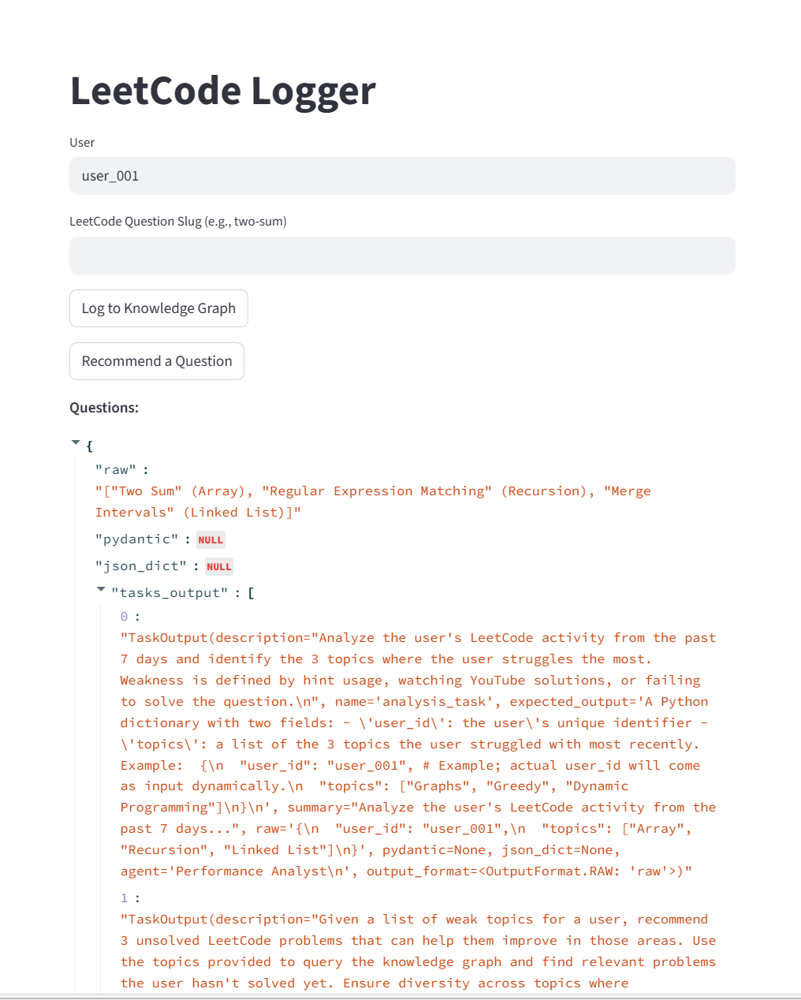
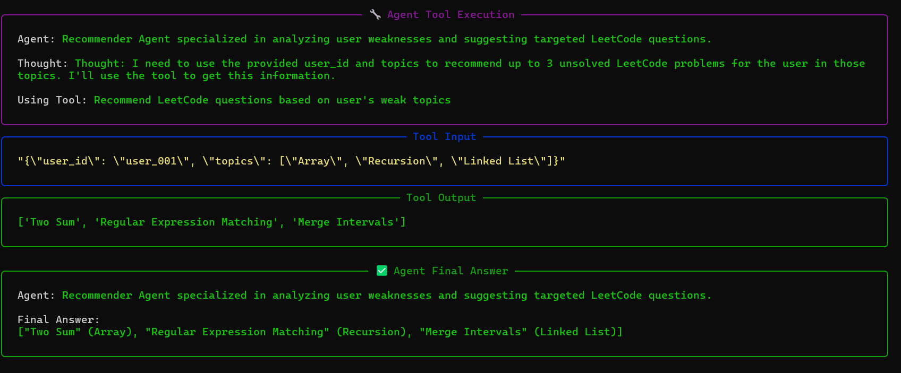

## 1. Create and Activate Virtual Environment
```bash
python3 -m venv leetcode_venv
```

```bash
source venv/bin/activate
```

## 2. Alfa LeetCode API Setup

Please follow the official instructions from the [Alfa LeetCode API repository](https://github.com/alfaarghya/alfa-leetcode-api) to set up the project

Fork the repository on GitHub, then clone your fork:

```bash
git clone https://github.com/<your-username>/alfa-leetcode-api.git
```

```bash
cd alfa-leetcode-api
```

```bash
npm install
```

## 3. CrewAI Setup

Please follow the official instructions from CrewAI (https://docs.crewai.com/en/installation) to set up the project

install `uv`:

```bash
curl -LsSf https://astral.sh/uv/install.sh | sh
```

```bash
uv tool install crewai
```

## 4. Install Python requirements
```bash
pip install dotenv neo4j pyyaml streamlit
```


## 5. Running the App

### 1. Set up environment variables
```bash
LEETCODE_API_KEY=your_leetcode_api_key
NEO4J_URI=bolt://localhost:7687
NEO4J_USER=neo4j
NEO4J_PASSWORD=your_password
```

### 2. Open Neo4j
Ensure Neo4j is running and connected to the correct database.

### 3. Load mock data
```bash
python3 test.py
```

### 4. Run the Streamlit app:
```bash
python3 streamlit run app.py
```

This will open a local Streamlit web interface.

## 6. App Features (with Mock Data)
Once the app is running:
- Recommend Strategy: Click on the "recommend strategy" button to get strategy recommendations based on mock data stored in the Neo4j database.



